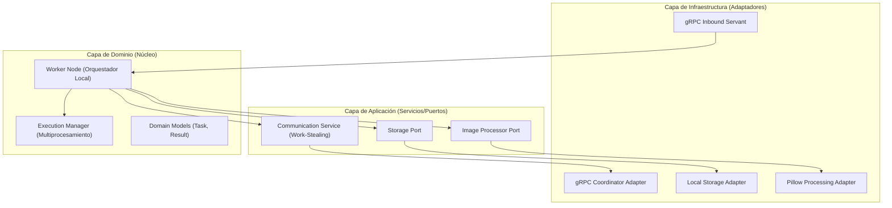

# 🚀 Distributed Image Worker (Hexagonal Edition)

Worker inteligente en Python diseñado para el procesamiento paralelo de imágenes en sistemas distribuidos. Este nodo utiliza una **Arquitectura Hexagonal (Puertos y Adaptadores)** para garantizar modularidad, testabilidad y un desacoplamiento total de la infraestructura.

---

## 🏗️ Arquitectura del Sistema

El Worker sigue los principios de **Clean Architecture**, dividiendo las responsabilidades en capas concéntricas:



---

## 📂 Estructura de Carpetas

```text
Nodo/
├── worker/                     # Código fuente raíz
│   ├── application/            # Casos de uso y contratos (Puertos)
│   │   ├── ports/              # Interfaces (IP, Storage, Coordinator)
│   │   └── services/           # Lógica de comunicación (Work-Stealing)
│   ├── domain/                 # Modelos de negocio puros y excepciones
│   ├── infrastructure/         # Implementaciones concretas (Adaptadores)
│   │   └── adapters/           # gRPC, Storage y Pillow (Engine)
│   ├── core/                   # Núcleo del nodo y gestión de estado
│   ├── grpc/                   # Adaptadores de entrada gRPC
│   └── server.py               # Composition Root (Punto de entrada)
├── proto/                      # Definiciones gRPC compartidas
├── tests/                      # Suite de pruebas unitarias e integración
└── data/                       # Almacenamiento local (Input, Output, State)
```

---

## ⚙️ Cómo Funciona el Sistema

### 🧠 Modelo de Trabajo: Work-Stealing (PULL)
A diferencia de los sistemas tradicionales donde el servidor "empuja" tareas, este worker es **proactivo**:
1. El `CommunicationService` solicita tareas al Orquestador Java cuando el nodo tiene capacidad libre.
2. Si el Orquestador tiene trabajo, el worker lo "roba" (Stealing) y lo añade a su cola de prioridad local.
3. El `ExecutionManager` procesa las imágenes en **procesos independientes** para evitar el Python GIL (Global Interpreter Lock), garantizando un uso real de los núcleos del CPU.

<<<<<<< Updated upstream
Cada worker levanta un servidor gRPC con dos contratos:
=======
### 💾 Persistencia de Estado
El nodo es **tolerante a fallos**. Guarda su estado (tareas pendientes y resultados no enviados) en `data/state/`. Si el worker se reinicia, cargará las tareas pendientes y las reanudará automáticamente.
>>>>>>> Stashed changes

---

## 🚀 Ejecución del Proyecto

<<<<<<< Updated upstream
Protos:

- [proto/imagenode.proto](proto/imagenode.proto)
- [proto/worker_node.proto](proto/worker_node.proto)

## Estructura recomendada para leer el proyecto

Empieza por estos archivos:

1. [worker/server.py](worker/server.py)
2. [worker/core/worker_runtime.py](worker/core/worker_runtime.py)
3. [worker/grpc/image_node_service.py](worker/grpc/image_node_service.py)
4. [worker/grpc/worker_control_service.py](worker/grpc/worker_control_service.py)
5. [worker/execution](worker/execution)

Arbol principal que conviene conservar:

```text
worker/
proto/
scripts/
examples/
tests/
docs/
  api/
  reports/
```

Los archivos con nombres viejos se mantienen por compatibilidad, pero los
modulos anteriores son los nombres canonicos para leer y mantener el proyecto.

Carpetas que se generan localmente y se pueden borrar sin afectar el codigo:

- `data/`
- `results/`
- `output/`
- `tmp/`
- `.run/`
- `.secrets/`
- `.pytest_cache/`
- `.pytest_tmp/`

Artefactos de demo generados:

- `docs/demo/demo-*`

El archivo [docs/demo/batch-image-list.txt](docs/demo/batch-image-list.txt)
si se conserva porque define el lote usado para comparar los tres workers.

## Modos de despliegue

### 1. Produccion: un worker por maquina o VM

Archivo:

- [docker-compose.yml](docker-compose.yml)

Este modo levanta solo:

- `worker`

Puertos por defecto:

- gRPC: `127.0.0.1:50051`
- Health: `http://127.0.0.1:8081/readyz`
- Metrics: `http://127.0.0.1:9100/metrics`

Uso:
=======
### 1. Requisitos Previos
- Python 3.11+
- [Pillow](https://python-pillow.org/) para procesamiento de imágenes.
- [gRPC](https://grpc.io/) para comunicación industrial.
>>>>>>> Stashed changes

### 2. Ejecución Local (Python)
Instala las dependencias y lanza el nodo:
```powershell
# Instalar dependencias
pip install -r requirements.txt

# Ejecutar el worker
python -m worker
```

### 3. Ejecución con Docker
Ideal para despliegues escalables:
```powershell
# Levantar un nodo individual
docker compose up -d --build

# Levantar entorno de desarrollo (3 nodos)
docker compose -f docker-compose-dev.yml up -d
```

---

<<<<<<< Updated upstream
### Enviar una tarea al contrato de control

```powershell
python examples/submit_task.py --target 127.0.0.1:50051
```

### Enviar una imagen real al contrato de negocio

```powershell
python examples/send_real_image.py --file "C:\ruta\imagen.png" --target 127.0.0.1:50051 --filter grayscale
```
=======
## 🛠️ Configuración (.env)

El archivo `.env` controla el comportamiento del nodo sin cambiar el código:
>>>>>>> Stashed changes

| Variable | Descripción | Default |
| :--- | :--- | :--- |
| `WORKER_NODE_ID` | Nombre único del nodo | hostname |
| `WORKER_BIND_PORT` | Puerto gRPC del worker | 50051 |
| `WORKER_COORDINATOR_TARGET` | Dirección del Orquestador Java | 127.0.0.1:50052 |
| `WORKER_MAX_ACTIVE_TASKS` | Tareas paralelas máximas | CPU cores |
| `WORKER_LOG_LEVEL` | Nivel de detalle (DEBUG, INFO) | INFO |

---

## 🧪 Pruebas
El proyecto incluye una suite de pruebas exhaustiva que valida la arquitectura:
```powershell
python -m pytest tests/
```

<<<<<<< Updated upstream
## Como se integra el servidor principal Java

Flujo esperado:

1. El servidor Java recibe la solicitud del cliente.
2. Consulta que workers estan disponibles.
3. Elige el worker mas conveniente.
4. Llama por gRPC:
   - `ImageNodeService` para procesamiento de negocio
   - o `WorkerControlService` para control fino del nodo
5. Recibe el resultado.
6. Guarda estado, metricas historicas y graficas en su propia BD.

En corto:

- Java decide y coordina.
- Python procesa.

## Metricas y health

El worker puede exponer:

- `livez`
- `readyz`
- `metrics`

Eso es util para operacion, pruebas o integracion, pero la responsabilidad de
guardar historicos, persistir metricas y construir graficas debe quedar del
lado del servidor principal o su storage/BD.

## Costo heuristico por filtro para la cola

La cola local penaliza tareas mas costosas usando un peso base por filtro.
Ese valor no reemplaza la prioridad funcional, pero si ayuda a ordenar mejor
la ejecucion cuando entran trabajos heterogeneos.

Valores base actuales:

- `grayscale`: `0.35`
- `resize`: `0.95`
- `crop`: `0.25`
- `rotate`: `0.65`
- `flip`: `0.20`
- `blur`: `1.30`
- `sharpen`: `1.00`
- `brightness` / `contrast` / `brightness_contrast`: `0.60`
- `watermark_text`: `1.10`
- `format`: `0.30`
- `ocr`: `3.20`
- `inference`: `3.80`

Valores explicitos para conversion por formato destino:

- `format:jpg` / `format:jpeg`: `0.300`
- `format:bmp`: `0.255`
- `format:png`: `0.315`
- `format:tif` / `format:tiff`: `0.345`
- `format:ico`: `0.360`
- `format:webp`: `0.375`
- `format:gif`: `0.405`

Ajustes dinamicos importantes:

- `resize` sube mas si hace upscale y baja un poco si hace downscale.
- `rotate` cuesta menos en `90/180/270` que en angulos arbitrarios.
- `blur`, `sharpen` y `brightness_contrast` suben segun intensidad.
- `watermark_text` sube segun tamano y longitud del texto.
- `format` sube para formatos mas pesados como `webp`, `gif` o `ico`.

## Storage local del nodo

Cada worker materializa las entradas y salidas en disco local:

- `data/input`
- `data/output`
- `data/state`

En Docker esos paths viven dentro de `/app/data`.

El worker no necesita MinIO ni storage compartido para operar. Si el servidor
principal quiere centralizar resultados, debe copiarlos o persistirlos desde su
propio lado despues de recibir el reporte o el resultado.

## Scripts utiles

- [scripts/demo/demo_end_to_end.py](scripts/demo/demo_end_to_end.py)
- [scripts/dev/generate_dev_security_assets.py](scripts/dev/generate_dev_security_assets.py)
- [scripts/ops/healthcheck.py](scripts/ops/healthcheck.py)
- [scripts/backends/ocr_backend.py](scripts/backends/ocr_backend.py)
- [scripts/backends/inference_backend.py](scripts/backends/inference_backend.py)

## Comandos rapidos con PowerShell

- `.\run.ps1 worker-stack`
  Levanta un worker individual.

- `.\run.ps1 worker-down`
  Baja el worker individual.

- `.\run.ps1 dev-stack`
  Levanta el entorno local completo.

- `.\run.ps1 dev-down`
  Baja el entorno local completo.

- `.\run.ps1 compare-batch`
  Compara el mismo lote de imagenes contra `worker1`, `worker2` y `worker3`.

- `.\run.ps1 test`
  Ejecuta los tests.

## Estado final

El proyecto queda preparado para:

- desplegar un worker por maquina o VM
- usar storage local por nodo para entradas, salidas y estado
- dejar la coordinacion real en el servidor principal Java
- mantener un entorno local separado para pruebas con varios workers
=======
---
> [!TIP]
> **Diseño Hexagonal**: Si deseas cambiar el motor de procesamiento (ej: de Pillow a OpenCV) o el almacenamiento (ej: de Local a S3), solo tienes que crear un nuevo **Adaptador** e inyectarlo en `server.py`. El núcleo del sistema permanecerá intacto.
>>>>>>> Stashed changes
