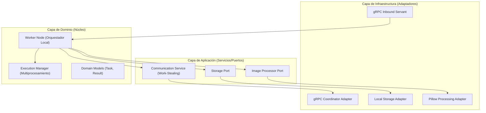

# 🚀 Distributed Image Worker (Hexagonal Edition)

Worker inteligente en Python diseñado para el procesamiento paralelo de imágenes en sistemas distribuidos. Este nodo utiliza una **Arquitectura Hexagonal (Puertos y Adaptadores)** para garantizar modularidad, testabilidad y un desacoplamiento total de la infraestructura.

---

## 🏗️ Arquitectura del Sistema

El Worker sigue los principios de **Clean Architecture**, dividiendo las responsabilidades en capas concéntricas:



---

## 📂 Estructura de Carpetas

```text
Nodo/
├── worker/                     # Código fuente raíz
│   ├── application/            # Casos de uso y contratos (Puertos)
│   │   ├── ports/              # Interfaces (IP, Storage, Coordinator)
│   │   └── services/           # Lógica de comunicación (Work-Stealing)
│   ├── domain/                 # Modelos de negocio puros y excepciones
│   ├── infrastructure/         # Implementaciones concretas (Adaptadores)
│   │   └── adapters/           # gRPC, Storage y Pillow (Engine)
│   ├── core/                   # Núcleo del nodo y gestión de estado
│   ├── grpc/                   # Adaptadores de entrada gRPC
│   └── server.py               # Composition Root (Punto de entrada)
├── proto/                      # Definiciones gRPC compartidas
├── tests/                      # Suite de pruebas unitarias e integración
└── data/                       # Almacenamiento local (Input, Output, State)
```

---

## ⚙️ Cómo Funciona el Sistema

### 🧠 Modelo de Trabajo: Work-Stealing (PULL)
A diferencia de los sistemas tradicionales donde el servidor "empuja" tareas, este worker es **proactivo**:
1. El `CommunicationService` solicita tareas al Orquestador Java cuando el nodo tiene capacidad libre.
2. Si el Orquestador tiene trabajo, el worker lo "roba" (Stealing) y lo añade a su cola de prioridad local.
3. El `ExecutionManager` procesa las imágenes en **procesos independientes** para evitar el Python GIL (Global Interpreter Lock), garantizando un uso real de los núcleos del CPU.

### 💾 Persistencia de Estado
El nodo es **tolerante a fallos**. Guarda su estado (tareas pendientes y resultados no enviados) en `data/state/`. Si el worker se reinicia, cargará las tareas pendientes y las reanudará automáticamente.

---

## 🚀 Ejecución del Proyecto

### 1. Requisitos Previos
- Python 3.11+
- [Pillow](https://python-pillow.org/) para procesamiento de imágenes.
- [gRPC](https://grpc.io/) para comunicación industrial.

### 2. Ejecución Local (Python)
Instala las dependencias y lanza el nodo:
```powershell
# Instalar dependencias
pip install -r requirements.txt

# Ejecutar el worker
python -m worker
```

### 3. Ejecución con Docker
Ideal para despliegues escalables:
```powershell
# Levantar un nodo individual
docker compose up -d --build

# Levantar entorno de desarrollo (3 nodos)
docker compose -f docker-compose-dev.yml up -d
```

---

## 🛠️ Configuración (.env)

El archivo `.env` controla el comportamiento del nodo sin cambiar el código:

| Variable | Descripción | Default |
| :--- | :--- | :--- |
| `WORKER_NODE_ID` | Nombre único del nodo | hostname |
| `WORKER_BIND_PORT` | Puerto gRPC del worker | 50051 |
| `WORKER_COORDINATOR_TARGET` | Dirección del Orquestador Java | 127.0.0.1:50052 |
| `WORKER_MAX_ACTIVE_TASKS` | Tareas paralelas máximas | CPU cores |
| `WORKER_LOG_LEVEL` | Nivel de detalle (DEBUG, INFO) | INFO |

---

## 🧪 Pruebas
El proyecto incluye una suite de pruebas exhaustiva que valida la arquitectura:
```powershell
python -m pytest tests/
```

---
> [!TIP]
> **Diseño Hexagonal**: Si deseas cambiar el motor de procesamiento (ej: de Pillow a OpenCV) o el almacenamiento (ej: de Local a S3), solo tienes que crear un nuevo **Adaptador** e inyectarlo en `server.py`. El núcleo del sistema permanecerá intacto.
